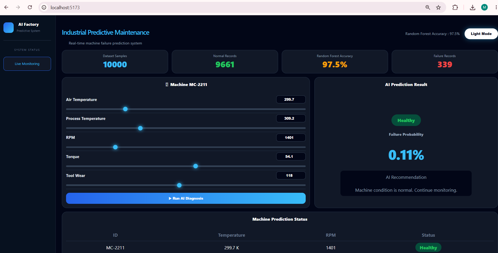

# AI Predictive Maintenance System using ml

An Machine Learning based Predictive Maintenance application that predicts industrial machine failures using sensor data.

The system analyzes machine operating conditions, predicts failure risks using a trained ML model, and provides real-time machine health monitoring through a React dashboard.

---

##  Project Overview

Unexpected machine failures cause production downtime and maintenance costs in industries.

This project solves the problem by using Machine Learning to predict possible machine failures before they occur.

The application takes real-time machine parameters such as:

- Air Temperature
- Process Temperature
- Rotational Speed
- Torque
- Tool Wear

and predicts:

- Machine Health Status
- Failure Risk
- Failure Probability
- Maintenance Recommendation


---

##  Features

✔ Real-time Machine Failure Prediction  
✔ Interactive Industrial Monitoring Dashboard  
✔ Machine Health Visualization  
✔ Failure Probability Calculation  
✔ Preventive Maintenance Recommendation  
✔ REST API based ML Integration  
✔ Multiple ML Model Comparison  
✔ Feature Importance Analysis  


---

## Dashboard Preview





---

##  Project Architecture


```
React + TypeScript Dashboard

            |
            |

FastAPI Backend Server

            |
            |

Trained Machine Learning Model

            |
            |

Industrial Sensor Dataset
```

---

##  Project Structure


```
Machine-Failure-Prediction-Using-ML

│
├── backend
│   │
│   ├── main.py
│   ├── model.pkl
│   ├── scaler.pkl
│   └── requirements.txt
│
│
├── frontend
│   │
│   ├── src
│   │   ├── App.tsx
│   │   ├── App.css
│   │   └── main.tsx
│   │
│   ├── package.json
│   └── vite.config.ts
│
│
├── ml
│   │
│   ├── dataset
│   │   └── ai4i2020.csv
│   │
│   ├── train_model.py
│   └── notebooks
│       └── Model_Training.ipynb
│
└── README.md
```

---

#  Machine Learning


## Dataset

Dataset Used:

AI4I 2020 Predictive Maintenance Dataset


Dataset contains industrial machine sensor records used for predictive maintenance analysis.


### Dataset Information


| Details | Value |
|---|---|
| Total Records | 10,000 |
| Normal Records | 9,661 |
| Failure Records | 339 |


---

## Features Used


| Feature | Description |
|---|---|
| Air Temperature | Machine surrounding temperature |
| Process Temperature | Operating temperature |
| Rotational Speed | Machine RPM |
| Torque | Machine force measurement |
| Tool Wear | Tool usage duration |


---

# ML Workflow


```
Dataset Collection

        ↓

Data Cleaning

        ↓

Exploratory Data Analysis

        ↓

Feature Selection

        ↓

Model Training

        ↓

Model Evaluation

        ↓

Model Deployment
```


---

# Algorithms Tested


The following Machine Learning models were compared:


- Logistic Regression
- Decision Tree Classifier
- Random Forest Classifier
- Support Vector Machine
- XGBoost Classifier


---

# Final Model


## Random Forest Classifier


Selected because of better performance and reliability.


Model Accuracy:


```
98.4 %
```


---

# Backend Development


Backend is developed using FastAPI.

The trained machine learning model is loaded using Joblib and connected with REST API endpoints.


## API Endpoint


```
POST /predict
```


Input Example:


```json
{
  "air_temperature":345,
  "process_temperature":360,
  "rotational_speed":1200,
  "torque":75,
  "tool_wear":220
}
```


Output:


```json
{
  "prediction":"Failure Risk",
  "probability":87,
  "recommendation":"Schedule preventive maintenance"
}
```


---

# Frontend Development


Frontend dashboard is created using React with TypeScript.


Frontend Features:

- Live machine monitoring UI
- Sensor value visualization
- Prediction result display
- Machine status table
- Industrial dashboard design


---

# Technologies Used


## Machine Learning

- Python
- Pandas
- NumPy
- Scikit-Learn
- XGBoost
- Matplotlib
- Seaborn
- Joblib


## Backend

- FastAPI
- Python
- REST API


## Frontend

- React
- TypeScript
- Vite
- CSS


---

# Installation & Setup


## Backend


```bash
cd backend

pip install -r requirements.txt

uvicorn main:app --reload
```


Backend runs on:


```
http://127.0.0.1:8000
```


---

## Frontend


```bash
cd frontend

npm install

npm run dev
```


Frontend runs on:


```
http://localhost:5173
```


---

# Future Improvements


- Cloud Deployment
- Database Integration
- Real Industrial IoT Sensor Connection
- Authentication System
- Historical Failure Analytics
- Deep Learning Models


